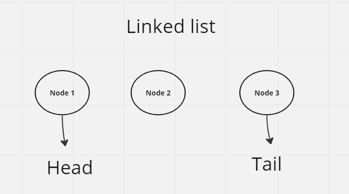
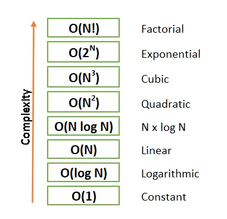

# Linked Lists

is a sequence of Nodes that are connected to each other.
Terminology (Linked Lists) includes ( Node, Next, Head, Tail).

## Big O

The worst case analysis of algorithm efficiency, depending in two factors:

- Running Time: The amount of time required for an algorithm to complete.
- Memory Space: The amount of memory resources required for an algorithm to complete.

-Understanding Big O notation is important in writing algorithms. It helps you determine when your algorithm is getting faster or slower. You can also compare different methods and choose the most efficient.

### examples

- Binary Search is O(log N) which is less complex than Linear Search. There are many more complex algorithms.
- An example of a quadratic algorithm or O(N²) is a nested for loop.
