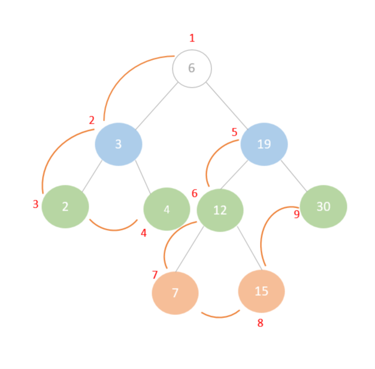

# Implementation: Trees

## Explain a detail in depth

- There are three kind of depth :

- pre-oreder  root >> left >> right

- in-order    left >> root >> right

- post-order  left >> right >> root

## example how depth work in preorder (visualization)

| Home Page               | [Home Page](./README.md)                                |
